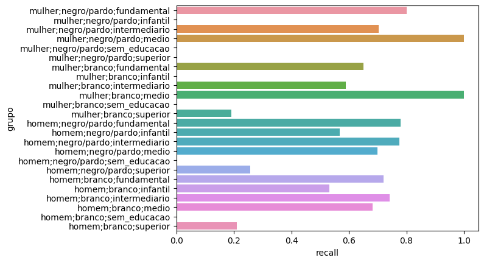
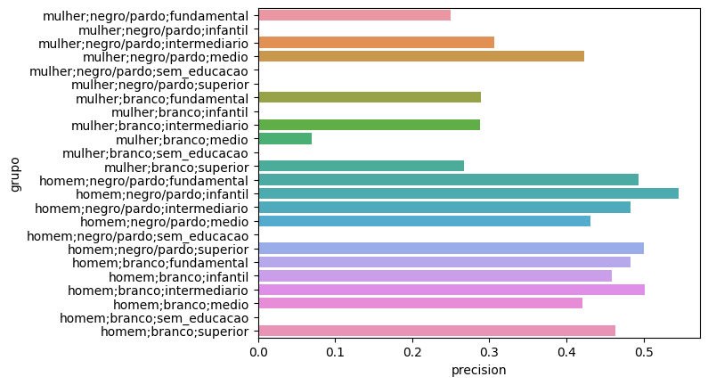

# **Predição de Risco de de Reincidênca Criminal**  

***

## **Detalhes do modelo**

***

**Descrição**: 
- Modelo desenvolvido para a disciplina de Aprendizado de Máquina Ético da Universidade Estadual de Campinas.
 
**Desenvolvedores**: 
- Bruno S. Martins, Guilherme P. Corrêa, Igor K. I. O. Nakashima
 
**Versão**: 1.0

**Caso de Uso**: 
- Estimativa de risco de reincidência criminal para ex-detentos do estado de Santa Catarina por parte de organizações não governamentais.
- Alocação de recursos para a reintegração de indivíduos com maior possibilidade de reincidência criminal.
 
**Fora de Escopo**: 
- Esse modelo não deve ser utilizado para casos de uso
que representam grandes riscos a liberdade ou bem estar de indivíduos. 
- Não deve ser utilizado dentro do ambiente jurídico ou influenciar em possíveis reduções ou aumentos na pena de cada indivíduo.

**Fatores**:
- aaa

## **Análise Quantitativa**

***

**Arquitetura**: 
- Regressão Logística calibrada e com hiperparâmetros escolhidos 
para maximizar o Recall.

**Data de Criação**: 
- 08 de Novembro de 2023.

**Informações de Contato**: 
- Em caso de dúvidas ou questionamentos, qualquer um 
dos autores do trabalho pode ser contactado.
 
**Pegada de Carbono**: 
- Treinado diversas vezes utilizando a plataforma colaborativa google colab.

**Dados de Treinamento**: 
- O classificador foi treinado utilizando o conjunto de dados 
"Reincidência Criminal por Gênero em Santa Catarina", disponibilizado pela 
Universidade Federal de Santa Catarina.

**Métricas Avaliadas**: 
- Utilizamos o Recall como principal métrica de avaliação. 
Desse modo, todos os hiperparâmetros do modelo foram otimizados para 
maximizar essa métrica.

**Resultados de Avaliação**: 
- O modelo apresentou 64% de Recall no conjunto de 
teste utilizado. 

## **Considerações Éticas e Limitações**

**Utilização Jurídica**: 
- Existem sérios problemas associados a utilização desse 
modelo dentro do contexto jurídico. 
